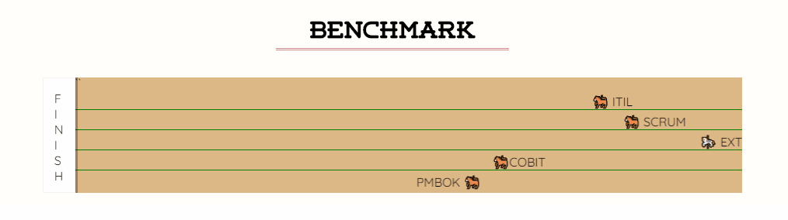

# *Code Smells* em Java

**You can also read in [English (EN)](README-en.md)**

***Smell*** em inglês significa **cheiro, odor, etc.** Trazendo esse conceito pro mundo do código, ***Code Smell*** significa aquele código que não parece cheirar bem, apesar de está funcionando corretamente.

<figure class="image">
  
  <figcaption> Esta é a sua reação ao ver um <strong><i>code smell</strong></i></figcaption>
</figure>

Creio que todos os desenvolvedores já devem ter tido a sensação de olhar pra um código e pensar:

```
"Cara, que código terrível! Como eu posso deixar isso melhor?"
```

Se isso já aconteceu com você, não se preocupe - isso é mais normal do que você imagina. Porém, é importante saber **você também produz code smell** e isso é absolutamente normal, pois a maioria das pessoas **não percebem** quando estão estão fazendo :poop: no código.

Aqui, vamos aprender algumas coisas importantes para escrever bons códigos em Java: Como **identificar** um code smell e tambémcomo **remover** code smells (refactoring).


Mas antes, precisamos falar sobre alguns princípios de **Programação Orientada a Objetos**


## Pilares da Programação Orientada a Objetos

### Paradigma Procedural (a.k.a Código "Macarrônico")

Qual o problema do código abaixo

```c
//Código fonte obtido em https://github.com/emacdona/tictactoe/blob/master/main.c
#include <stdio.h>
#include "board.h"
int main(int argc, char* argv[])
{
   //Variáveis de controle
   char board[3][3];
   char input[3];
   int moveTo;
   int turn = 0;
   char player;

   //Definição da função
   initBoard(board);

   //Lógica do Jogo
   while(1){
      player = (turn % 2) ? 'o' : 'x';
      system("clear");
      drawBoard(board);

      if(state(board) == 1){
         printf("\nWinner!\n");
         return 0;
      }

      if(state(board) == -1){
         printf("\nDraw!\n");
         return 0;
      }

      printf("\n(turn #%i) To which square would you (player %c) like to move? ", turn, player);
      fgets(input, 3, stdin);
      moveTo = atoi(input);

      if(mv(board, moveTo, player))
         turn++;

      printf("\n");
   }

   return 0;
}


```
### Programação orientada a objetos

- **Encapsulamento**
- **Abstração**
- Herança
- Polimorfismo

Uma solução mais simples ao jogo da velha:

```java 
public class Program {
    public static void main() {
        Game game = new TicTacToe();
        game.play();
    }
}

public interface Game {
    void play();
}

public class TicTacToe implements Game {
    private Player player1;
    private Player player2;
    private Board board;
    private Player currentPlayer;
    public TicTacToe(){
        this.player1 = new Player("X");
        this.player2 = new Player("O");
        this.board = new Board();
    }

    // Implementa toda a lógica do jogo
    public void play() { /* ... */ }

    // Lógica interna (não externalizada a quem tá utilizando a classe)
    private boolean hasWinner() { /* ... */ }

    //...
}

public class Player {
    private String symbol;
    public Player(String symbol) {
        this.symbol = symbol;
    }

    public String getSymbol() {
        return this.symbol;
    }
}

public class Board {
    private String[][] board;
    public Board() {
        this.board = new String[3][3];
    }
    
    public void draw() { /* ... */ }
}

```


## S.O.L.I.D

S.O.L.I.D é um acrônimo para cinco princípios de programação orientada a objetos. Esses princípios são importantes para identificar quando o 


**Qual o problema com esse código**

```java
public class UserService extends DatabaseConection {
    
    public void register(User user){

        // Valida o e-mail

        if(user.getEmail() == null){
            throw new Exception("E-mail informado é nulo");
        }

        if(!isValidEmail(user.getEmail())){
            return new Exception("O e-mail informado não é válido");
        }

        // Verifica se o usuário existe na base
        Connection conn = super.getConnection();
        Statement stmt = conn.createStatement();
        ResultSet rs = stmt.executeQuery("SELECT ID FROM USERS WHERE EMAIL = " + user.getEmail());
        
        //Se não existir, insere na base


        rs.close();
        stmt.close();
        conn.close();


    }

    private boolean isValidEmail(String emailStr) {
        String regEx = "^[A-Z0-9._%+-]+@[A-Z0-9.-]+\\.[A-Z]{2,6}$";
        Pattern pattern = Pattern.compile(regEx, Pattern.CASE_INSENSITIVE);
        Matcher matcher = pattern.matcher(emailStr);
        return matcher.find();
    }
}

```

**Solução um pouco mais elegante:**

```java
public abstract class Validator<T> {
    public abstract ValidationResult isValid(T item);

    public boolean isValidEmail(String email){
        String regEx = "^[A-Z0-9._%+-]+@[A-Z0-9.-]+\\.[A-Z]{2,6}$";
        Pattern pattern = Pattern.compile(regEx, Pattern.CASE_INSENSITIVE);
        Matcher matcher = pattern.matcher(emailStr);
        return matcher.find();
    }

    // ...

}

public class ValidationResult {
    private List<String> errors = new ArrayList();

    public void addError(String error){
        this.errors.add(error);
    }

    public boolean hasErrors(){
        this.errors.size() > 0;
    }

    public List<String> getErrors() {
        return this.errors;
    }
}


public class UserValidator extends Validator<User> {
    public ValidationResult isValid(User user) {
        ValidationResult results = new ValidationResult();
        if(user.getEmail() == null){
            results.addError("E-mail informado é nulo");
        }

        if(!isValidEmail(user.getEmail())){
            results.addError("E-mail informado é inválido")
        }

        // ...

        return results;
    }
}

public abstract class Repository<T> {
    public abstract T create(T item);
    public abstract T read(long id);
    public abstract T update(T item);
    public abstract void delete(long id);
    public abstract bool exists(T item);
}


public class UserService {

    private Validator<User> validator;
    private Repository<User> repository;

    public UserService(Validator<User> validator, Repository<User> repository) {
        this.validator = validator;
        this.repository = repository;
    }

    public void register(){
        if(validator.isValid() && ){

        }
    }
}
```

**Qual o problema com esse código?**

```java
enum TipoPagamento {
    BOLETO,
    CARTAO_CREDITO,
    CARTAO_DEBITO
    //EM_ESPECIE
}

public class PagamentoService {

    public void pagar(double valor, TipoPagamento tipoPagamento, Cliente cliente){
        if(tipoPagamento.BOLETO){
            /* Implementação do código */
            salvaNoBanco(pagamentoBoleto, cliente);
        }
        
        if(tipoPagamento.CARTAO_CREDITO){
            /* Implementação do código */
            salvaNoBanco(pagamentoCartao, cliente);
        }
        // ...
    }
}
```

### ***Single Responsibility Principle (SRP)***

``` 
Uma classe deve ter um, e somente um, motivo para ser modificada
```

### ***Open-Closed Principle (OCP)***

```
Aberto para extensão (open), fechado para modificação (closed)
```

### ***Liskov Substitution Principle (LSP)***

```

```

### ***Interface Segregation Principle (ISP)***

### ***Dependency Inversion Principle (DIP)***

```
Dependa sempre de abstrações, não de implementações
```


# Code Smells

- São indícios em um código que indicam que eles não estão seguindo os bons princípios da OO e do SOLID.
- São derivações dos pilares da POO.


## Code smells a nível de aplicação

- [Duplicated Code]()
- [Contrived complexity]()
- [Shotgun surgery]()


## Code smells a nível de classe

- [Large class]()
- [Feature envy]()
- [Inappropriate intimacy]()
- [Refused bequest]()
- [Excessive use of literals]()
- [Cyclomatic complexity]()
- [Downcasting]()
- [Orphan variable or constant class]()

## Code mells a nível de método

- [Too many parameters]()
- [Long method]()
- [Excessively short identifiers]()
- [Excessive return of data]()
- [Excessively long line of code (or God Line)]()


## A importância do processo de desenvolvimento de software

Eu sei, a maioria dos programadores não gostam de falar de processos, pois as vezes nós temos uma sensação que eles mais atrapalham do que ajudam.

### Extreme Go Horse


O [eXtreme Go Horse (XGH)](https://sou.gohorseprocess.com.br/extreme-go-horse-xgh/) é uma sátira genial de como os softwares são desenvolvidos sem nenhuma metodologia.


#### Alguns axiomas do XGH (a.k.a como os softwares são feitos hoje em dia)

**1. Pensou, não é XGH.**

XGH não pensa, faz a primeira coisa que vem à mente. Não existe segunda opção, a única opção é a mais rápida.

**9 - Seja autêntico, XGH não respeita padrões.**

Escreva o código como você bem entender, se resolver o problema, commit e era isso.

**20 - Teste é para os fracos.**

Se você meteu a mão num sistema XGH, é melhor saber o que está fazendo. E se você sabe o que está fazendo, vai testar pra que? Testes são desperdício de tempo, se o código compilar, é o suficiente.


#### Benchmark




### Code Review

### Testes unitários e TDD


